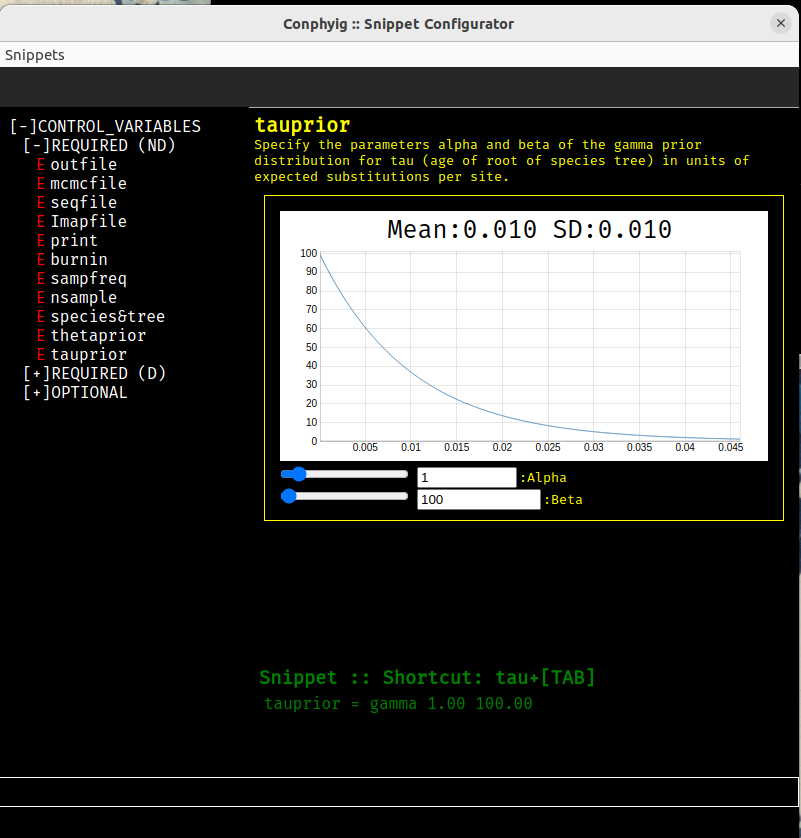

# bppgui
Graphical tools for editing input files and viewing output of bpp program

## Overview
This project includes a suite of cross-platform graphical tools for use with bpp (written using [Electron](https://www.electronjs.org/)). There will be multiple programs
designed for different purposes. The directory `filetools` contains a control file editor with syntax
aware highlighting, a syntax checker (linter), and a snippet creator all designed to simplify the
creation of control files that conform to the most recent version of the bpp program. Ultimately,
there will be a second suite of programs for viewing and manipulating gene trees and species trees.

